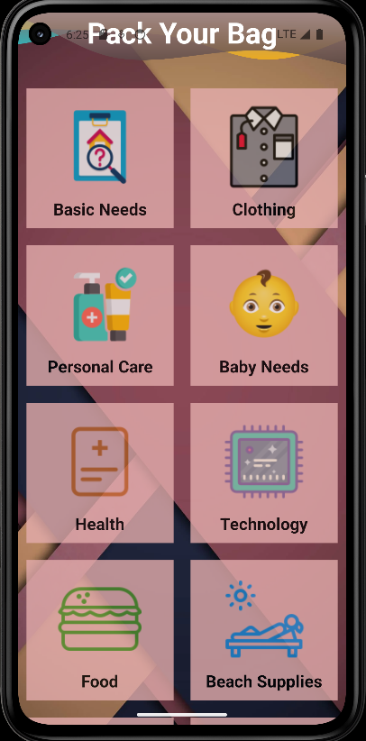
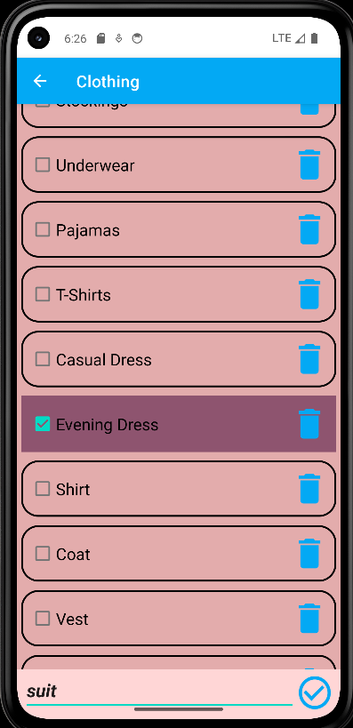
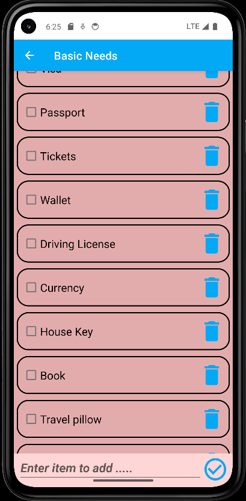

<p align="center">
    
    
    
</p>


# 🎒 Pack Your Bag - Android Application  

## 📌 Overview  
**Pack Your Bag** is a simple **Android application** built using **Java** to help users create and manage their packing checklist efficiently. This app ensures you never forget essential items again by allowing you to:  

✅ **Add** items to your packing list  
✅ **Delete** unnecessary items  
✅ **Update** item names if needed  
✅ **Mark items as packed** once added to the bag  

## 🚀 Features  
- **User-Friendly Interface** – Simple and intuitive UI for easy navigation.  
- **Dynamic List Management** – Add, update, delete, and mark items as packed.  
- **Data Persistence** – Ensures that your list remains saved even after app relaunch.  

## 🛠️ Tech Stack  
- **Language:** Java  
- **Framework:** Android SDK  
- **IDE:** Android Studio  
- **Storage:** SQLite (or SharedPreferences, depending on implementation)  

## 📥 Installation & Setup  
Follow these steps to **set up and run** the app on your Android device or emulator:  

1. **Clone the repository**  
   ```sh
   git clone https://github.com/your-username/Pack-Your-Bag.git
   cd Pack-Your-Bag
   ```
## 📂 Open the Project in Android Studio  

1. Open **Android Studio**.  
2. Go to **File → Open** and select the project folder.  

## ▶️ Build & Run the App  

1. Connect an **Android device** (or start an emulator).  
2. Click **Run (▶️)** in Android Studio.  

## 🔄 Relaunching the Application  

### From Android Studio:  
1. Open **Android Studio**.  
2. Select the project and click **Run (▶️)**.  

### From Device (after installation):  
1. Locate the **Pack Your Bag** app in your app drawer.  
2. Tap to open it.  

## 📝 Usage Instructions  

1. **Open the app** to access your packing checklist.  
2. Click **➕ Add Item** to insert a new item into the list.  
3. To **mark an item as packed**, tap on it.  
4. Swipe **left/right to delete** an item.  
5. **Long press** on an item to **update its name**.  
